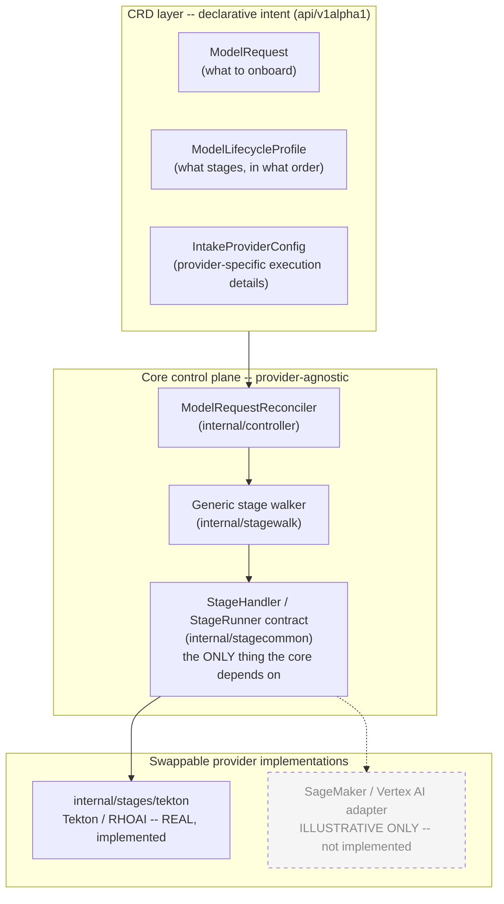

# ModelOps

A CRD-driven Kubernetes control plane for governing the AI/ML model
lifecycle — intake, validation, approval-gated promotion, and (per the
roadmap below) everything after that.

## What this is

Most organizations already have MLOps/LLMOps tooling: a training
platform, a model registry, a serving stack, maybe RHOAI, SageMaker, or
Databricks. What they usually don't have is a consistent, auditable way
to *enforce* their own process across all of it — the same approval
gates, the same evidence trail, the same promotion sequence, regardless
of which tool happened to run a given stage.

**ModelOps is that governance and orchestration layer.** It is not a
platform that replaces RHOAI, SageMaker, Databricks, or any other
ML/LLM tooling — it sits above whichever tools an organization already
uses for each lifecycle stage, and decouples two things that are
usually tangled together:

- **Process** — the sequence of stages a model must pass through,
  the approval gates between them, the evidence each stage must
  produce, and the audit trail of what happened and who approved it.
- **Execution** — the actual mechanics of running a security scan, a
  benchmark, a deployment, a registry write. These are provider
  details.

Kubernetes custom resources declare the process as data
(`ModelLifecycleProfile.Spec.Stages`); a generic reconciler enforces it
without knowing anything about how any individual stage's work
actually gets done; and a small provider interface (`StageHandler` /
`StageRunner`) is the only seam where execution-engine-specific code is
allowed to exist.

**The CRDs and the operator that reconciles them are the product.**
The tools underneath — Tekton, RHOAI, or anything else a
`StageRunner` wraps — are swappable by design, not by aspiration.

## This repo's Tekton/RHOAI implementation is a reference architecture

To be unambiguous: everything under `operator/internal/stages/tekton`
is **one concrete, working provider implementation** — a reference
architecture — not "the solution." It happens to be the provider this
repo actually runs today (Tekton PipelineRuns on Red Hat OpenShift AI),
and it's real, tested, working code, not a stub. But it is deliberately
kept behind the same `StageHandler`/`StageRunner` contract every other
provider would use.

Concretely, `internal/stages/tekton` is what an adapter looks like:

- It resolves an `IntakeProviderConfig` (or falls back to a deprecated
  inline pipeline reference) to get the Tekton-specific pipeline name,
  service account, and workspace bindings.
- It builds and tracks a `tektonv1.PipelineRun`, and maps the
  PipelineRun's `Succeeded` condition back into the generic
  `stagecommon.StageStatus` (`Running`/`Succeeded`/`Failed`) the core
  reconciler actually understands.
- Nothing outside this package imports `tektonv1`, or reads a Tekton
  condition, or knows a PipelineRun exists.

A SageMaker Pipelines adapter, a Databricks Jobs adapter, or anything
else would implement the exact same two-method contract
(`StageHandler.BuildSpec` / `StageRunner.EnsureRun`) in its own package
under `internal/stages/`, and the core reconciler would not change at
all. `internal/stages/noop` is a second, trivial `StageRunner` that
exists purely to prove this — it creates no child object of any kind
and unconditionally reports success, and the reconciler drives a
`ModelRequest` through the identical phase transitions whether it's
wired to `noop` or to `tekton`. It is not a second real integration;
no SageMaker or Databricks adapter exists in this repo today.

## Architecture



The core reconciler and stage walker depend only on the
`StageHandler`/`StageRunner` interfaces in `internal/stagecommon` —
never on `tektonv1`, never on a Tekton condition, never on any
concrete provider package. `internal/stages/tekton` is the one real
implementation of that contract in this repo; the second box is drawn
purely to illustrate the shape a second provider would take.

## Current scope: this repo implements one stage of a larger lifecycle

**Only model intake is implemented today**: capacity planning →
sandbox validation (security scan, benchmark) → approval-gated
promotion across namespaces → registration. Everything else below is
a roadmap item — a planned placeholder, not a partially-built feature.
No CRDs, controllers, or code exist yet for anything past intake.

```mermaid
flowchart LR
    Intake["Model Intake<br/>(implemented)"]:::done
    Finetune["Fine-tuning /<br/>Retraining"]:::planned
    Guardrails["Guardrails<br/>(runtime policy)"]:::planned
    Monitoring["Production Monitoring<br/>& Drift Detection"]:::planned
    Redeploy["Redeployment /<br/>Rollback"]:::planned
    Testing["Testing & Evaluation<br/>(ongoing)"]:::planned
    Retire["Retirement /<br/>Decommissioning"]:::planned

    Intake --> Finetune --> Guardrails --> Monitoring --> Redeploy --> Testing --> Retire

    classDef done fill:#2f9e44,stroke:#2f9e44,color:#ffffff
    classDef planned fill:#f1f3f5,stroke:#adb5bd,stroke-dasharray: 5 5,color:#868e96
```



| Stage | Status | What exists today |
|---|---|---|
| **Model intake** (capacity planning → sandbox validation → approval-gated promotion → registration) | **Implemented** | `ModelRequest`, `ModelLifecycleProfile`, `IntakeProviderConfig`, `PlatformConfig`, `CapacityPlan` CRDs; a working reconciler, stage walker, and Tekton provider adapter, all with test coverage (see `docs/PHASE_LOG.md`) |
| Fine-tuning / retraining | Planned | No CRD, no controller, no code |
| Guardrails (runtime policy enforcement) | Planned | No CRD, no controller, no code |
| Production monitoring & drift detection | Planned | No CRD, no controller, no code |
| Redeployment / rollback | Planned | No CRD, no controller, no code |
| Testing & evaluation (ongoing, post-deployment) | Planned | No CRD, no controller, no code. Distinct from intake's own pre-promotion security scan/benchmark, which are one-time onboarding gates, not ongoing evaluation of a running model |
| Retirement / decommissioning | Planned | No CRD, no controller, no code |

## CRD reference

All CRDs are in the `modelops.example.io/v1alpha1` API group, defined
in `operator/api/v1alpha1/*_types.go`.

### `ModelRequest`

The user-facing unit of lifecycle intent: "onboard this model under
this profile." One object per model going through intake; its
`Status` is what a `kubectl get modelrequest` or the model-intake UI
shows for progress.

Key spec fields:

- `model` — source type/URI/name/version/tokenizer of the model being onboarded.
- `lifecycleProfile` — the name of the `ModelLifecycleProfile` this request follows.
- `requirements` — GPU config, benchmark targets, security thresholds, and deployment shape (grouped sub-structs, inlined flat on the wire for backward compatibility).
- `access` — who's authorized to view/interact with this request.
- `evalhubSecretName` / `huggingfaceSecretName` / `scanS3SecretName` / `resultS3SecretName` — Secret *references*; credentials are never accepted as inline spec values.
- `maas` — optional Models-as-a-Service deployment override.

Key status fields:

- `phase` — coarse outcome: `"<stage>Running"` while active, `"Succeeded"`/`"Failed"` once terminal, or a `*LookupFailed`/`*SetupFailed`/`NoStagesConfigured` reason for a config error.
- `currentStage` / `stages` — which named profile stage the walker is/was on, and the outcome of every (stage, namespace) pair attempted so far.

```yaml
apiVersion: modelops.example.io/v1alpha1
kind: ModelRequest
metadata:
  name: granite-2b-onboarding
  namespace: sandbox
spec:
  model:
    sourceType: huggingface
    uri: ibm-granite/granite-3.3-2b-instruct
    name: granite-2b
    version: v1
  lifecycleProfile: standard-generative-onboarding
  requirements:
    contextLength: 32768
    expectedConcurrency: 4
    gpuIsolationPolicy: dedicated
    cveThreshold: critical
    securityThreshold: block
  access:
    authorizedViewers: "alice, bob, group:ml-team"
    accessRole: view
  requestedBy: ops-team
  evalhubSecretName: evalhub-credentials
  scanS3SecretName: scan-s3-credentials
  resultS3SecretName: result-s3-credentials
```

### `ModelLifecycleProfile`

The declarative *process*: an ordered list of named stages a
`ModelRequest` referencing this profile must pass through, plus which
provider config and platform config back each stage.

Key spec fields:

- `stages` — `[]ProfileStageSpec`, each with a `name` (unique within the profile), `kind` (which `StageRunner` executes it — `"CapacityPlan"` or `"PipelineRun"` today), an optional per-stage `providerConfigRef`, `required` (default `true` — a failed required stage stops the whole walk), `perNamespace` (fans the stage out across the request's promotion namespaces), and `namespaceSetup` (RBAC/label provisioning to perform before running the stage in a given namespace).
- `platformConfigRef` — the `PlatformConfig` this profile's stages read shared plumbing from.
- `workflow` — DEPRECATED inline pipeline reference, honored only as a fallback for stages that don't set their own `providerConfigRef`.

```yaml
apiVersion: modelops.example.io/v1alpha1
kind: ModelLifecycleProfile
metadata:
  name: standard-generative-onboarding
  namespace: sandbox
spec:
  platformConfigRef: default-modelops-platform
  stages:
    - name: capacity
      kind: CapacityPlan
    - name: sandbox
      kind: PipelineRun
      providerConfigRef:
        name: standard-generative-onboarding-provider
      namespaceSetup:
        ensureRBAC: true
        labels:
          evalhub.trustyai.opendatahub.io/tenant: ""
    - name: promotion
      kind: PipelineRun
      perNamespace: true
      providerConfigRef:
        name: standard-generative-onboarding-provider
      namespaceSetup:
        ensureRBAC: true
        labels:
          maas.opendatahub.io/gateway-access: "true"
          opendatahub.io/dashboard: "true"
          opendatahub.io/generated-namespace: "true"
```

### `IntakeProviderConfig`

Provider-specific execution details for a `PipelineRun`-kind stage,
referenced by a profile stage's `providerConfigRef`. Today this is
Tekton-only (`providerType: tekton` is the only value the CRD's own
enum accepts), but the kind is deliberately generic — a discriminator
field plus provider-specific fields, not a Tekton-typed struct — so a
second real provider could add its own `providerType` value without a
new kind.

Key spec fields:

- `providerType` — which `StageRunner` understands this config (`"tekton"` only, today).
- `sandboxPipelineName` / `promotionPipelineName` — the Tekton Pipeline to run for each stage kind.
- `serviceAccountName`, `pipelineTimeout`, `workspaces` — the PipelineRun's service account, timeout, and workspace bindings (PVC- or ConfigMap-backed).

```yaml
apiVersion: modelops.example.io/v1alpha1
kind: IntakeProviderConfig
metadata:
  name: standard-generative-onboarding-provider
  namespace: sandbox
spec:
  providerType: tekton
  sandboxPipelineName: model-intake-sandbox
  promotionPipelineName: model-intake-promotion
  serviceAccountName: pipeline
  workspaces:
    - name: shared-workspace
      persistentVolumeClaim: guidellm-output-pvc
    - name: manifests
      configMap: mmlu-manifest
```

### `PlatformConfig`

Shared, cluster-level plumbing that any profile's stages can read —
the "where things live on this cluster" details kept out of both the
per-request `ModelRequest` and the per-workflow `ModelLifecycleProfile`.

Key spec fields (a representative subset — see `platformconfig_types.go` for the full ~30-field list):

- `complianceS3Bucket` / `securityS3Bucket` — result storage buckets.
- `registryServer` / `registryPort` / `registryAuthor` — model registry connection.
- `gpuOperatorNamespace` / `clusterPolicyName` / `timeSlicingConfigMap` / `maxTimeSlices` / `maxGPUsPerRequest` — GPU capacity-planning plumbing and ceilings.
- `evalhubUrl`, `approvalApiUrl`, `benchmarkProfile`/`benchmarkRate`/... — evaluation, approval, and benchmark endpoints/defaults.
- `maasServingNs` / `maasPolicyNs` / ... — Models-as-a-Service defaults.

```yaml
apiVersion: modelops.example.io/v1alpha1
kind: PlatformConfig
metadata:
  name: default-modelops-platform
  namespace: sandbox
spec:
  complianceS3Bucket: compliance-artifact-results
  securityS3Bucket: security-scan-results
  registryServer: http://modelops-registry.rhoai-model-registries.svc.cluster.local
  registryPort: "8080"
  gpuOperatorNamespace: nvidia-gpu-operator
  clusterPolicyName: gpu-cluster-policy
  maxTimeSlices: 8
  evalhubUrl: default-evalhub-redhat-ods-applications.apps.example.com
  benchmarkProfile: constant
  benchmarkRate: 4.0
```

### `CapacityPlan`

A per-model GPU capacity recommendation, created by the `capacity`
stage's handler and reconciled independently by its own
`CapacityPlanReconciler` (the actual GPU-sizing heuristic lives here,
not in the generic stage walker).

Key spec fields:

- `modelRef.modelRequestName` — which `ModelRequest` this plan is for.
- `contextLength` / `concurrency` / `allowTimeSlicing` / `allowMIG` / `isolationPolicy` — the sizing inputs.
- `maxGPUsPerRequest` — an optional configured ceiling; exceeding it sets `status.phase: Failed` instead of silently clamping.

Key status fields: `phase`, `gpusNeeded`, `gpuModel`, `message`.

```yaml
apiVersion: modelops.example.io/v1alpha1
kind: CapacityPlan
metadata:
  name: granite-2b-onboarding-capacity
  namespace: sandbox
spec:
  modelRef:
    modelRequestName: granite-2b-onboarding
  contextLength: 32768
  concurrency: 4
  allowTimeSlicing: true
  isolationPolicy: dedicated
  gpuOperatorNamespace: nvidia-gpu-operator
  clusterPolicyName: gpu-cluster-policy
status:
  phase: Succeeded
  gpusNeeded: 4
  gpuModel: NVIDIA-A100-40GB
  message: "Capacity plan: 4 x NVIDIA-A100-40GB for context=32768 concurrency=4 time-slicing=true"
```

## Operator architecture

Package layout (`operator/internal/`):

| Package | Role |
|---|---|
| `controller` | `ModelRequestReconciler`/`CapacityPlanReconciler` — resolves the profile/platform config, drives the generic stage walker, persists `ModelRequest.Status`. Never imports a provider-specific package. |
| `stagewalk` | The generic stage walker (`Walk`). Iterates `profile.Spec.Stages` in order, dispatches to the registered `StageHandler`/`StageRunner` for each, and decides advance/stop/tolerate purely from `stagecommon.StagePhase` and the stage's own `Required`/`PerNamespace` flags. Never branches on a stage's name or kind — those are registry lookups, not switch statements. Pure/client-free, so it's tested entirely with in-memory fakes. |
| `stagecommon` | The shared contract every stage package and the walker depend on: `StageHandler`, `StageRunner`, `StageSpec`, `StageStatus`, `StageContext`. The one package every `internal/stages/*` package is allowed to depend on. |
| `stages/sandbox`, `stages/promotion`, `stages/capacityplanning` | One `StageHandler` per built-in stage: builds *what* to run (params, workflow ref, deterministic run name) from a `StageContext`. No package under `stages/*` may import another — this is enforced, not just documented (see `docs/REFACTOR_PLAN.md`'s modularity principle). |
| `stages/tekton` | The real `StageRunner`: builds/tracks a `PipelineRun` and maps its condition into `StageStatus`. See "reference architecture" above. |
| `stages/noop` | The minimal `StageRunner`: creates nothing, always reports success. The simplest possible example of the runner side of the contract. |

**`StageHandler` vs. `StageRunner`**: a `StageHandler.BuildSpec(StageContext) (StageSpec, error)` decides *what* a stage invocation should run (params, which pipeline/job, a deterministic name) — pure data, no I/O. A `StageRunner.EnsureRun(ctx, *ModelRequest, StageSpec) (StageStatus, error)` decides *how* to actually make that happen against a real execution engine, and reports back a provider-agnostic `Running`/`Succeeded`/`Failed`. The walker calls a `StageHandler` (keyed by stage `Name`) to get a `StageSpec`, then hands that `StageSpec` to a `StageRunner` (keyed by stage `Kind`) to execute it — two independent registries, wired together in `main.go`, never a hardcoded pairing.

**How the walker drives a `ModelRequest`**: for each `ProfileStageSpec` in `profile.Spec.Stages`, in order, the walker resolves the target namespace(s) (the request's own namespace, or its promotion namespaces if `PerNamespace`), optionally prepares each one (`NamespaceSetup`), builds a `StageContext`, calls the stage's `StageHandler` then `StageRunner`, and records the outcome. A `Succeeded` stage advances; a `Running` stage stops the walk for this reconcile (retried on the next one); a `Failed` *required* stage stops the walk immediately; a `Failed` *optional* stage (`required: false`) is recorded and tolerated. `ModelRequest.Status.CurrentStage`/`Status.Stages[]` are written straight from the walker's result, generically, regardless of what a profile names its stages.

**Adding a new provider**: implement `stagecommon.StageHandler`/`StageRunner` in a new package under `internal/stages/`, following the same package-isolation rule as every existing stage package (never import a sibling `internal/stages/*` package — shared code goes in `stagecommon`). `internal/stages/noop` is the smallest possible `StageRunner` to start from; `internal/stages/tekton` is the real, full-featured example (provider config resolution, condition mapping, `OwnedTypesProvider` for RBAC/watch wiring). Register the new packages in `main.go`'s `StageHandlers`/`StageRunners` maps under whatever `Name`/`Kind` a `ModelLifecycleProfile` should reference, and grant the new package's own `+kubebuilder:rbac` markers (see `docs/RBAC.md` for how permissions are currently split by package).

## Getting started / deployment

This platform is deployed via ArgoCD (OpenShift GitOps) — **not**
`kubectl apply`. The GitOps structure is the source of truth:

- `gitops/applications/` — one ArgoCD `Application` per deployable component (the operator, runtime config, the model-intake UI, MinIO, MLflow, EvalHub, MaaS, model registry, RBAC, ...), aggregated by `gitops/root-app.yaml` (an app-of-apps).
- `gitops/components/` — the Kustomize-based resources each `Application` actually syncs (CRDs and the operator `Deployment` under `components/operator`, the live `ModelLifecycleProfile`/`IntakeProviderConfig`/`PlatformConfig` objects under `components/runtime-config`, and so on).

Point ArgoCD's app-of-apps (`gitops/root-app.yaml`) at a cluster and it
reconciles every child `Application` from there; see `gitops/README.md`
for cluster-bootstrap prerequisites (OpenShift GitOps, RHOAI, OpenShift
Pipelines operators). Changing behavior means changing a file under
`gitops/` and letting ArgoCD sync it — not running an imperative
command against a live cluster.

## Further reading

This README is the stable, public-facing explanation of what this
repo is and how it's put together. For the detailed implementation
history, the design rationale behind specific decisions, and the
phase-by-phase record of what changed and why (including real bugs
only caught by live-cluster testing), see:

- `docs/REFACTOR_PLAN.md` — the phased instructions this operator was built against.
- `docs/PHASE_LOG.md` — the handoff log for every phase, including verification detail this README deliberately doesn't duplicate.
