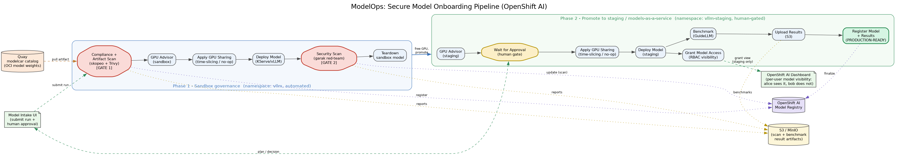

= Secure Model Onboarding and Evaluation with OpenShift AI

*The LLM Selection Problem*

As organizations rush to adopt AI they quickly find that LLMs are not created equal and
model selection is not an easy task. Allowing developers to download and deploy any model
they want is not sustainable. This creates massive security vulnerabilities, leads to
resource waste, and provides no clear way to compare model capabilities for a given
business problem.

*The Solution: A Governed ModelOps Onboarding Pipeline*

A central ModelOps team acts as the gatekeeper, running every candidate model through an
automated, gated OpenShift pipeline before it is ever made available for internal use.
The pipeline:

* *Securely ingests* a candidate model from a trusted OCI "modelcar" catalog (Quay) and
  scans both its provenance/compliance metadata and the serving image for vulnerabilities
  (Trivy) *before* it is ever deployed.
* *Red-teams the live model* with garak via EvalHub to catch unsafe behavior, in an
  isolated sandbox namespace.
* *Advises on GPU placement*, automatically recommending (and applying) NVIDIA GPU
  time-slicing so a new model can safely co-reside on a GPU that is already in use.
* *Requires human approval* before promoting the model into a "staging" (models-as-a-service)
  namespace.
* *Benchmarks* infrastructure performance with GuideLLM via EvalHub once promoted.
* *Records everything* in the OpenShift AI Model Registry, updating the same entry at every
  stage so there is a single, auditable record of the model's onboarding.
* *Controls visibility*, granting specific users/groups access to see the promoted model in
  the OpenShift AI dashboard via namespace RBAC.

This process creates a central registry of *approved, production-ready* models that gives
teams a safe, documented starting point.

== The Pipeline Flow

A human submits a candidate model through the *Model Intake UI*, which starts a Tekton
`PipelineRun`. The pipeline runs in two phases on a single cluster (the "staging cluster"
is simulated as a separate namespace, `vllm-staging`). Gating is enforced by task failure:
if any gate fails, the pipeline halts and downstream stages never run.

=== Phase 1 — Sandbox governance (namespace: `vllm`, automated)

. *Compliance + Artifact Scan* [GATE 1] — Pulls the candidate's OCI modelcar artifact,
  checks compliance policy (architecture/OS/provenance/license), and runs a Trivy CVE scan
  of the serving image. Registers the model in the Model Registry with the results. A
  failure here halts the pipeline before any deployment (the model is still registered,
  marked FAILED, with links to the S3 reports).
. *GPU Advisor (sandbox)* — Inspects the GPU inventory and any models already resident on
  it. Recommends a topology (dedicated, tensor-parallel, or GPU time-slicing) and, when
  needed, generates the exact time-slicing configuration and a per-model memory split.
. *Apply GPU Sharing (sandbox)* — Applies the time-slicing plan when the GPU is already
  occupied. No-op when a dedicated GPU is free.
. *Deploy Model* — Deploys the model (KServe/vLLM) so it can be scanned live.
. *Security Scan (garak)* [GATE 2] — Runs a live garak red-team scan against the endpoint
  via EvalHub and updates the registry entry with the results. Halts on findings above the
  configured tolerance.
. *Teardown* — Removes the sandbox deployment to free the GPU for staging.

=== Phase 2 — Promote to staging (namespace: `vllm-staging`, human-gated)

[start=7]
. *GPU Advisor (staging)* — Independently assesses the staging environment's GPU.
. *Wait for Approval* — Publishes the deployment plan to the Model Intake UI and blocks
  until a human approves or rejects it.
. *Apply GPU Sharing (staging)* — Applies the approved staging time-slicing plan.
. *Deploy Model (staging)* — Deploys into the staging namespace.
. *Grant Model Access* — Creates namespaced RoleBindings for RHOAI dashboard visibility.
. *Benchmark (GuideLLM via EvalHub)* — Benchmarks infrastructure performance.
. *Register Model + Results* — Updates the existing registry entry with the benchmark
  results and marks the model PRODUCTION-READY.

=== Phase 3 — MaaS production deployment (optional)

Deploys the model via Models-as-a-Service CRDs with API-key auth, rate limiting, and
API Gateway routing.

== Personas

The term ModelOps is used throughout this project. Role mapping: ModelOps could be your IT
operations team or DevOps team — the team responsible for safely bringing models into the
organization and publishing trusted baselines.

[[pre-reqs]]
== Prerequisites

- OpenShift cluster
- OpenShift AI installed with the *Model Registry* component enabled
- NVIDIA GPU Operator installed (required for GPU time-slicing)
- OpenShift Pipelines (Tekton) operator installed
- An S3-compatible object store (MinIO is included below)
- Cluster admin access

[[getting-started]]
== Getting Started

There are two ways to deploy the pipeline components: using an *agentic skill* (recommended
for the GPU advisor configuration) or using *`oc` commands* directly. Both approaches are
covered below.

[[agentic-approach]]
=== Approach 1: Agentic skill-based deployment

The project includes the *OpenShift vLLM GPU Deployment Advisor* skill
(`openshift-vllm-gpu-advisor-skill/`). This skill can be used by your AI coding assistant
(Codex, OpenCode, Claude Code, etc.) to:

. Discover GPU resources in your OpenShift cluster.
. Size the LLM model and recommend a deployment topology (dedicated GPU, tensor-parallel,
  or time-slicing with memory splits).
. Apply the recommended GPU sharing configuration.

.Load the skill into your AI coding assistant
[source,sh,role=execute]
----
# In your AI coding tool, load the skill file:
openshift-vllm-gpu-advisor-skill/OpenShift-vLLM-GPU-Deployment-Advisor-SKILL.md
----

Then prompt your assistant to deploy the pipeline:

> Deploy the model onboarding pipeline to my OpenShift cluster. Walk through each step:
> setting up namespaces, storage, model registry, RBAC, pipeline tasks, and the intake UI.
> Use the GPU advisor skill to configure time-slicing if needed.

The skill walks through all of the manual deployment steps below in a guided fashion.
This is the recommended approach when you are new to the pipeline and want step-by-step
assistance through the configuration.

[[oc-approach]]
=== Approach 2: Deploy with `oc` commands

Follow the steps below to deploy every component manually. All commands assume you are
logged into OpenShift as a cluster admin.

[source,sh,role=execute]
----
oc login --token=<token> --server=<cluster-api-url>
----

==== 1. Clone the repository

[source,sh,role=execute]
----
git clone <repo-url> model_onboarding_pipeline
cd model_onboarding_pipeline
----

==== 2. Create namespaces

The pipeline uses two namespaces: `vllm` (sandbox) and `vllm-staging` (staging). A third
namespace `s3-storage` hosts MinIO for scan and benchmark artifacts.

[source,sh,role=execute]
----
oc apply -f model-intake-pipeline/pipeline/sandbox-namespace.yaml
oc apply -f model-intake-pipeline/pipeline/staging-namespace.yaml
oc new-project s3-storage
----

Both sandbox and staging namespaces are labeled for the OpenShift AI dashboard and EvalHub
tenant recognition.

==== 3. Deploy S3 storage (MinIO)

[source,sh,role=execute]
----
oc apply -f storage/minio-backend.yaml -n s3-storage
oc apply -f storage/s3ui-deployment.yaml -n s3-storage
----

MinIO credentials default to `minio` / `minio123`. After deploying, get the S3 UI route:

[source,sh,role=execute]
----
oc get route -n s3-storage s3-ui-route -o jsonpath='{.spec.host}'
----

Log into the S3 UI and create the following buckets:

* `benchmark-results` — GuideLLM and lm-eval result artifacts
* `compliance-artifact-results` — Compliance/artifact scan reports
* `security-scan-results` — garak security scan reports

==== 4. Set up the Model Registry

. Enable the Model Registry component in OpenShift AI:
+
[source,sh,role=execute]
----
oc patch datasciencecluster default-dsc --type=merge -p \
  '{"spec":{"components":{"modelregistry":{"managementState":"Managed"}}}}'
----

. Deploy the MySQL database backing the registry:
+
[source,sh,role=execute]
----
oc apply -f model-registry/mysql-pvc.yaml
oc apply -f model-registry/mysql-secret.yaml
oc apply -f model-registry/mysql-service.yaml
oc apply -f model-registry/mysql-deployment.yaml
----

. Create the model registry instance through the OpenShift AI web console:
+
.. Navigate to *Settings → Model registry settings → Create model registry*.
.. Fill in the form:
+
* **Name:** `model-registry`
* **Host:** `mysql.rhoai-model-registries.svc.cluster.local`
* **Port:** `3306`
* **Username:** `admin`
* **Password:** `mysql-admin`
* **Database:** `sampledb`
+
Wait for the registry status to show *Available*.

==== 5. Configure RBAC

The pipeline service account needs access to the Model Registry and S3 storage:

[source,sh,role=execute]
----
oc adm policy add-role-to-user edit system:serviceaccount:vllm:pipeline -n rhoai-model-registries
oc adm policy add-role-to-user view system:serviceaccount:vllm:pipeline -n s3-storage
----

Apply GPU sharing RBAC (allows the pipeline to manage NVIDIA time-slicing):

[source,sh,role=execute]
----
oc apply -f model-intake-pipeline/pipeline/gpu-sharing-rbac.yaml
----

If using a remote GPU advisor endpoint, create the credentials secret:

[source,sh,role=execute]
----
oc apply -f model-intake-pipeline/pipeline/gpu-advisor-credentials-secret.yaml -n vllm
# Edit the secret to set your API key:
oc patch secret gpu-advisor-credentials -n vllm --type=merge \
  -p '{"stringData":{"api-key":"<your-api-key>"}}'
----

==== 6. Enable EvalHub (TrustyAI)

EvalHub runs the garak security scan and GuideLLM benchmarks. Enable it in OpenShift AI:

[source,sh,role=execute]
----
oc patch datasciencecluster default-dsc --type=merge -p \
  '{"spec":{"components":{"trustyai":{"managementState":"Managed",
  "eval":{"lmeval":{"permitCodeExecution":"allow","permitOnline":"allow"}}}}}}'
----

Deploy the EvalHub custom resource:

[source,sh,role=execute]
----
oc apply -f evalhub/evalhub-cr.yaml
----

Wait for EvalHub pods to be ready:

[source,sh,role=execute]
----
oc get pods -n redhat-ods-applications --watch | grep evalhub
----

==== 7. Deploy pipeline tasks

Apply all Tekton task definitions to the `vllm` namespace:

[source,sh,role=execute]
----
# Phase 1 tasks
oc apply -f model-intake-pipeline/pipeline/compliance-artifact-scan-task.yaml
oc apply -f model-intake-pipeline/pipeline/gpu-advisor-task.yaml
oc apply -f model-intake-pipeline/pipeline/apply-gpu-sharing-task.yaml
oc apply -f model-intake-pipeline/pipeline/deploy-model-task.yaml
oc apply -f model-intake-pipeline/pipeline/security-scan-task.yaml
oc apply -f model-intake-pipeline/pipeline/teardown-model-task.yaml
# Phase 2 tasks
oc apply -f model-intake-pipeline/pipeline/approval-gate-task.yaml
oc apply -f model-intake-pipeline/pipeline/grant-model-access-task.yaml
oc apply -f model-intake-pipeline/pipeline/guidellm-benchmark-task.yaml
oc apply -f model-intake-pipeline/pipeline/upload-guidellm-results-task.yaml
oc apply -f model-intake-pipeline/pipeline/model-registry-task.yaml
# Phase 3 (optional)
oc apply -f model-intake-pipeline/pipeline/deploy-maas-task.yaml
----

==== 8. Deploy the pipeline

[source,sh,role=execute]
----
oc apply -f model-intake-pipeline/pipeline/model-intake-pipeline.yaml
oc apply -f model-intake-pipeline/pipeline/pvc.yaml
----

==== 9. Deploy the Model Intake UI

[source,sh,role=execute]
----
oc apply -f model-intake-ui/deployment.yaml
----

If you need to rebuild the UI container image:

[source,sh,role=execute]
----
cd model-intake-ui
podman build -t quay.io/<your-org>/model-intake-ui:latest -f Containerfile .
podman push quay.io/<your-org>/model-intake-ui:latest
oc rollout restart deployment/model-intake -n vllm
----

Get the UI route:

[source,sh,role=execute]
----
oc get route -n vllm model-intake -o jsonpath='{.spec.host}'
----

==== 10. (Optional) Deploy the Results UI

The Results UI visualizes GuideLLM benchmark results from S3:

[source,sh,role=execute]
----
oc apply -f results-ui/deployment.yaml
----

== Running the Pipeline

=== Via the Model Intake UI

. Open the Model Intake UI route in your browser.
. Fill out the form:
+
* **Model section:** Set `model-id` to a Hugging Face model (e.g.
  `ibm-granite/granite-3.3-2b-instruct`). `model-name` auto-populates.
* **EvalHub section:** Set `evalhub-token` to your OpenShift OAuth token
  (`oc whoami -t`). This is required for the garak scan and GuideLLM benchmark.
* **GPU Advisor section:** Adjust `context-length` and `concurrency` to match your
  hardware.
* Leave other fields at their defaults unless you need to customize.
. Click *Submit Model for Onboarding*.
. Monitor progress in *Pipeline Runs* tab. When the pipeline reaches the approval gate,
  go to *Deployment Plans*, review the GPU plan, and *Approve*.

Required fields (`model-id`, `model-name`, `evalhub-token`) are validated before submission.
The form will not submit if any are empty.

=== Via direct PipelineRun

Create a PipelineRun YAML (see `model-intake-pipeline/pipeline/model-intake-pipelinerun.yaml`
for a template) and apply it:

[source,sh,role=execute]
----
oc create -f model-intake-pipeline/pipeline/model-intake-pipelinerun.yaml -n vllm
----

Monitor the run:

[source,sh,role=execute]
----
oc get pipelineruns -n vllm --watch
----

View task logs from the OpenShift web console (*Pipelines → PipelineRuns* → click the run
→ *Logs* tab) or via:

[source,sh,role=execute]
----
tkn pipelinerun logs <pipelinerun-name> -n vllm -f
----

== Key Pipeline Parameters

|===
| Parameter | Default | Description

| `model-id`
| `ibm-granite/granite-3.3-2b-instruct`
| Hugging Face model ID

| `model-name`
| `granite-2b`
| Kubernetes-safe name (auto-derived from model-id)

| `evalhub-url`
| `evalhub-redhat-ods-applications.apps.<cluster>`
| EvalHub FQDN for garak + GuideLLM

| `evalhub-token`
| *(required, no default)*
| OpenShift OAuth token for EvalHub API (`oc whoami -t`)

| `severity-threshold`
| `block`
| garak gate strictness: `block`, `high`, `medium`, `low`

| `artifact-cve-threshold`
| `critical`
| Trivy CVE gate: `critical`, `high`, `medium`, `low`, `none`

| `context-length`
| `32768`
| Max context length for GPU sizing

| `concurrency`
| `4`
| Expected concurrent requests for GPU sizing

| `guidellm-profile`
| `constant`
| GuideLLM benchmark profile: `constant`, `sweep`, `throughput`

| `guidellm-rate`
| `4.0`
| Requests per second for benchmark

| `guidellm-max-seconds`
| `15`
| Max seconds per benchmark rate step

| `guidellm-max-requests`
| `2`
| Max requests per benchmark rate step
|===

== Project Structure

[source]
----
model_onboarding_pipeline/
  README.adoc                              # This file
  model-intake-pipeline/
    pipeline/                              # Tekton Pipeline + Tasks (YAML)
      model-intake-pipeline.yaml           # Main pipeline definition
      compliance-artifact-scan-task.yaml   # Gate 1: compliance + Trivy scan
      security-scan-task.yaml              # Gate 2: garak via EvalHub
      gpu-advisor-task.yaml               # GPU inventory + deployment plan
      apply-gpu-sharing-task.yaml          # NVIDIA time-slicing apply
      deploy-model-task.yaml              # vLLM Helm deployment
      approval-gate-task.yaml             # Human approval gate
      guidellm-benchmark-task.yaml        # GuideLLM benchmark
      model-registry-task.yaml            # Registry upsert
      sandbox-namespace.yaml              # vllm namespace
      staging-namespace.yaml              # vllm-staging namespace + RBAC
      ...
  model-intake-ui/                         # Flask intake UI (Python)
    app.py
    deployment.yaml
    Containerfile
  results-ui/                              # Benchmark results viewer (Python)
    app.py
    deployment.yaml
    Containerfile
  storage/                                 # MinIO + S3 browser UI
    minio-backend.yaml
    s3ui-deployment.yaml
  model-registry/                          # MySQL backend for Model Registry
    mysql-deployment.yaml
    mysql-pvc.yaml
    mysql-secret.yaml
    mysql-service.yaml
  evalhub/                                 # EvalHub CR for garak + GuideLLM
    evalhub-cr.yaml
  openshift-vllm-gpu-advisor-skill/        # Agentic GPU advisor skill
    SKILL.md
    subskills/
      gpu-discovery/SKILL.md
      model-sizing/SKILL.md
      vllm-recommendation/SKILL.md
  rhoai-workbench/                         # Jupyter notebooks for manual workflows
  docs/                                    # Tutorial documents
----
