[[model-ops]]
= ModelOps tutorial (est. 1 hour)

*Goal*: As a member of the ModelOps team I want to be able to bring in models from external sites, get baseline performance and accuracy results on that model, and register the model along with the results in a central model registry. This will enable people in my organization to discover models that might be good candidates for their applications.  

NOTE: This section requires admin access because you'll be installing operators and creating new projects.

=== Configure OpenShift AI Model Registry
. Clone the project repository
+
[source,sh,role=execute]
----
git clone https://github.com/jhurlocker/modelops-benchmarking.git
----

. Make sure you're logged into your OpenShift cluster as *admin*. You can copy the login command from the OpenShift web console in the top right dropdown under your username. 
+
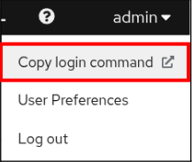
+
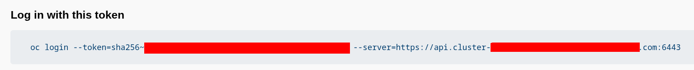

. It is recommended to upgrade your cluster to 2.25. To upgrade your cluster patch the operator subscription. 
+
Open a terminal window and login to your OpenShift cluster with the token you copied in the previous step.
+
[source,sh,role=execute]
----
oc patch subscription rhods-operator \
  -n redhat-ods-operator \
  --type='merge' \
  -p '{"spec":{"channel":"stable-2.25"}}'
----
+
The upgrade will take a few minute. Make sure you wait until the new version is installed before proceeding. In your OpenShift web console go to *Installed Operators* and select your *redhat-ods-operator* project. Go to the *Events* tab and make sure that the install strategy completed.
+
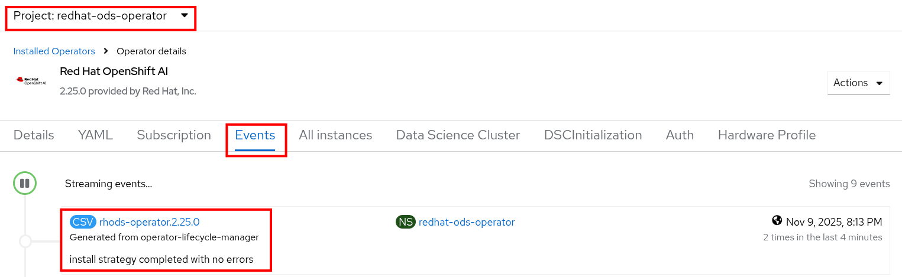

. To enable your OpenShift AI model registry run the below command to patch your default data science cluster.
+
[source,sh,role=execute]
----
oc patch datasciencecluster default-dsc --type=merge -p '{"spec":{"components":{"modelregistry":{"managementState":"Managed"}}}}'
----

. The model registry needs a database to store version data. In the project you cloned change the directory to *modelops-benchmarking* and apply the deployment below so the model registry can store data.
+
[source,sh,role=execute]
----
oc apply -f model-registry/mysql-pvc.yaml
oc apply -f model-registry/mysql-secret.yaml
oc apply -f model-registry/mysql-service.yaml
oc apply -f model-registry/mysql-deployment.yaml
----

. Create a model registry through the OpenShift AI web console.

.. Login to your OpenShift AI web console. To find the route go to your OpenShift web console and click on *Network -> Routes*. Search for *rhods* and click on the location URL.
+
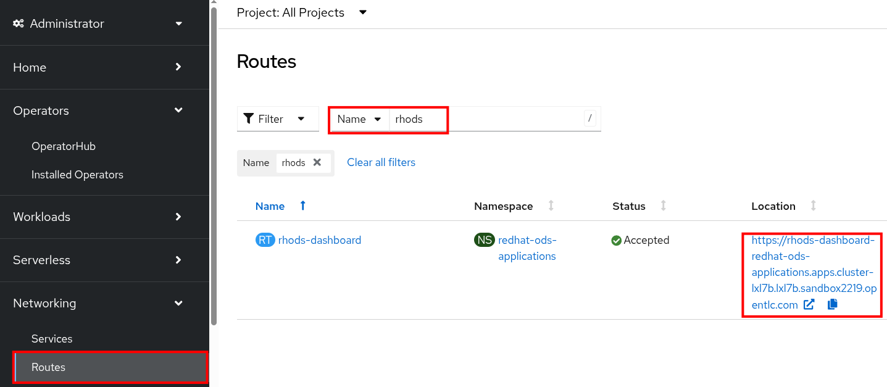

.. In OpenShift AI go to *Settings -> Model registry settings*. Click on *Create model registry*.
+
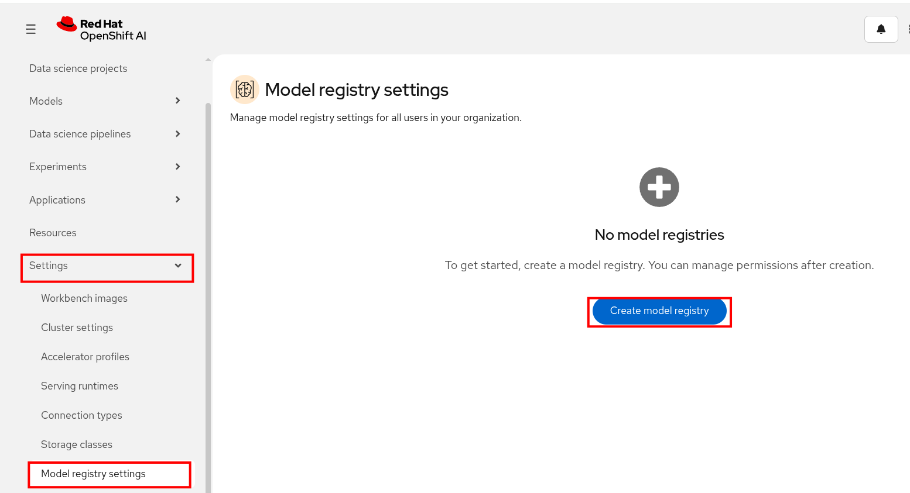

.. Add the following data in the form and click *Create*.
+
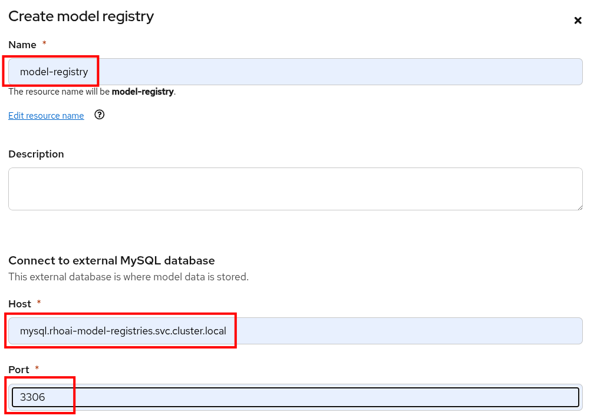
+
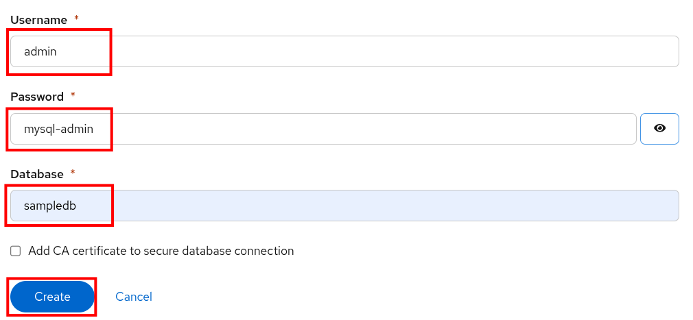
+
*Name*: 
+
[source,sh,role=execute]
----
model-registry
----
+
*Host*:
+
[source,sh,role=execute]
----
mysql.rhoai-model-registries.svc.cluster.local
----
+
*Port*:
+
[source,sh,role=execute]
----
3306
----
+
*Username*:
+
[source,sh,role=execute]
----
admin
----
+
*Password*:
+
[source,sh,role=execute]
----
mysql-admin
----
+
*Database*:
+
[source,sh,role=execute]
----
sampledb
----

.. In a few minutes your model registry status should be *Available*.
+
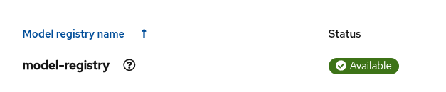

=== Setup S3 storage
We'll be deploying Minio for S3 storage and we'll use a generic UI to manage S3 buckets. The UI should work with any S3 compatible storage.

NOTE: If you already have S3 storage you can skip this section.

. Install Minio and the S3 UI
+
[source,sh,role=execute]
----
oc new-project s3-storage
oc apply -f storage/minio-backend.yaml -n s3-storage
oc apply -f storage/s3ui-deployment.yaml -n s3-storage
----  

. Login to the S3 UI and create a bucket. We'll use S3 to store GuideLLM results, lm-eval results, and custom benchmark files. 

.. Get the S3 UI route
+
[source,sh,role=execute]
----
oc get route -n s3-storage | grep s3-ui
----  

.. Enter the bucket name as *benchmark-results* and click *Create Bucket*.
+
*Bucket name*
+
[source,sh,role=execute]
----
benchmark-results
----  
+
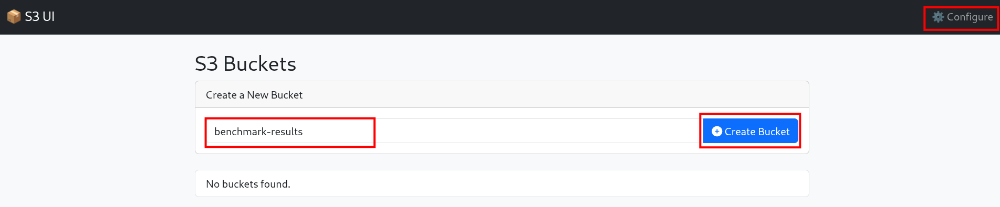
+
NOTE: The UI is configured to connect to the local Minio service running in the same namespace. If you are using another S3 storage provider click on the *Configure* button in the upper right corner to update the connection configuration. +
This UI is *not supported by Red Hat* or any other company and should be used for demo purposes only. 

[NOTE]
====
The model is sourced directly from Hugging Face (e.g., `ibm-granite/granite-3.3-2b-instruct`). No local container registry (Quay) is required.
====

=== Enable TrustyAI
We'll need to enable TrustyAI in OpenShift AI so we can run lm-evaluation harness. 

. Patch the default data science cluster to enable TrustyAI.
+
[source,sh,role=execute]
----
oc patch datasciencecluster default-dsc -p '{"spec":{"components":{"trustyai":{"managementState":"Managed"}}}}' --type=merge
----

. Wait for a few minutes for TrustyAI to become available.
+
[source,sh,role=execute]
----
oc get pods -n redhat-ods-applications --watch | grep trustyai
----
+
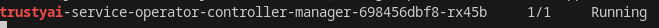

. Apply the below files to wrap up the TrustyAI configuration.
+
[source,sh,role=execute]
----
oc patch datasciencecluster default-dsc --type=merge -p '{"spec":{"components":{"trustyai":{"eval":{"lmeval":{"permitCodeExecution":"allow","permitOnline":"allow"}}}}}}'
----

=== Deploy the Pipeline
Now that we have all of the tools configured we can deploy our pipeline.

. Create a new project.
+
[source,sh,role=execute]
----
oc new-project vllm
----

. We need to give our pipeline service account access to be able to add new entries into the OpenShift AI model registry and also be able to get the routes in our s3-storage namespace so we can add them to the model registry.
+
[source,sh,role=execute]
----
oc adm policy add-role-to-user edit system:serviceaccount:vllm:pipeline -n rhoai-model-registries
oc adm policy add-role-to-user view system:serviceaccount:vllm:pipeline -n s3-storage
----

. Deploy the pipeline and pipeline tasks.
+
[source,sh,role=execute]
----
oc apply -f guidellm-pipeline/pipeline/security-scan-task.yaml -n vllm
oc apply -f guidellm-pipeline/pipeline/gpu-advisor-task.yaml -n vllm
cp guidellm-pipeline/pipeline/analyze_scan.py /tmp/
oc apply -f guidellm-pipeline/pipeline/guidellm-benchmark-task.yaml -n vllm
oc apply -f guidellm-pipeline/pipeline/upload-guidellm-results-task.yaml -n vllm
oc apply -f guidellm-pipeline/pipeline/lm-eval-task.yaml -n vllm
oc apply -f guidellm-pipeline/pipeline/model-registry-task.yaml -n vllm
oc apply -f guidellm-pipeline/pipeline/upload-lm-eval-results-task.yaml -n vllm
oc apply -f guidellm-pipeline/pipeline/model-intake-pipeline.yaml -n vllm
oc apply -f guidellm-pipeline/pipeline/pvc.yaml -n vllm
oc apply -f results-ui/deployment.yaml -n vllm
----

. We need to add configmaps to our pipeline run so that lm-eval-harness can load the appropriate evaluation tasks. We'll go into more detail on the LMEvalJob in later sections.
+
[source,sh,role=execute]
----
oc create configmap mmlu-manifest --from-file=guidellm-pipeline/pipeline/mmlu.yaml -n vllm
oc create configmap custom-mmlu --from-file=guidellm-pipeline/custom-lm-eval/custom-mmlu.yaml -n vllm
----

. Time to run the pipeline!
Before we apply the PipelineRun lets take a look at the parameters we're setting in *guidellm-pipeline/pipeline/model-intake-pipelinerun.yaml*.

.. Model parameters
+
*target*: The inference endpoint URL.
+
*model-name*: The model name we'll use in the deployment.
+
*processor*: The tokenizer we'll be using for GuideLLM and lm-eval.
+
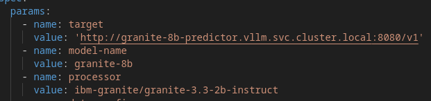

.. GuideLLM parameters
+
*data-config*: Number of prompt and output tokens for the default guidellm dataset.
+
*max-seconds*: Sets the maximum duration (in seconds) for each benchmark run.
+
*rate-type*: The type of benchmark to run. See https://github.com/vllm-project/guidellm/tree/main?tab=readme-ov-file#configurations for more information.
+
*rate*: For rate-type sweep, the number of benchmarks.
+
*api-key*: If we are requiring an API key on our inference server. We'll disable this and leave the parameter blank for the simplicity of this tutorial. 
+
*max-concurrency*: Maximum number of concurrent requests 
+
*huggingface-token*: We'll leave this blank since we don't need a token to pull down the tokenizer.
+
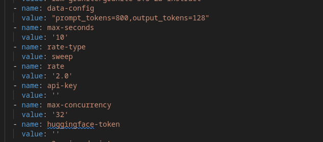

.. S3 parameters
+ 
*s3-api-endpoint*: S3 endpoint URL. We're using the service internal to the OpenShift cluster.
+
*s3-access-key-id*: S3 access key
+
*s3-secret-access-key*: S3 secret key
+
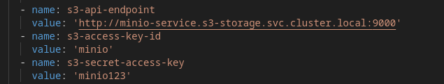

.. Security scan parameters (Gate 1)
+
*garak-probes*: Comma-separated list of Garak probes to run against the model endpoint.
+
*garak-detectors*: Comma-separated list of detectors to use (default: all).
+
*max-seeds*: Maximum number of test seeds per probe.
+
*severity-threshold*: Minimum severity level to fail the pipeline (block, high, medium, low).
+
image::../images/pipeline_params_security.png["Security scan parameters"]

.. GPU Advisor parameters (Gate 2)
+
*target-namespace*: Target OpenShift namespace for model deployment.
+
*context-length*: Context length for model sizing calculations.
+
*concurrency*: Number of concurrent sequences for memory estimation.
+
*allow-time-slicing*: Whether to consider time-slicing when GPUs are insufficient.
+
*allow-mig*: Whether to consider NVIDIA MIG (Multi-Instance GPU).
+
*gpu-isolation-policy*: GPU isolation policy (dedicated or shared).
+
image::../images/pipeline_params_gpu.png["GPU Advisor parameters"]

.. Benchmark parameters
+
*lm-eval-job-name*: The name of the LMEvalJob we'll be running.
+
*lm-eval-custom*: Are we using a custom evaluation dataset for lm-eval? For the initial run by the ModelOps team we'll run the default dataset.
+
*custom-data*: Are we using custom benchmark data for GuideLLM? For the initial run by the ModelOps team we'll run the default dataset.
+
*custom-filename*: Name of the custom prompt file to use. For the initial run by the ModelOps team we'll run the default dataset.
+
*model-reg-author*: The author of who created the version in the model registry.
+
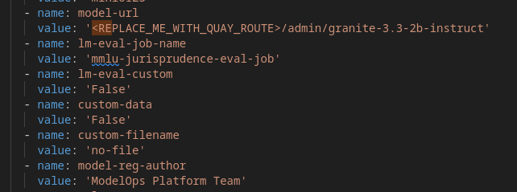

. Create a PipelineRun.
+
[source,sh,role=execute]
----
oc create -f guidellm-pipeline/pipeline/model-intake-pipelinerun.yaml -n vllm
----

. *View Pipelinerun* - Go to the OpenShift web console and select *Pipelines*. Make sure you have selected the *vllm* project. You should see the pipeline you applied earlier. Click the *PipelineRuns* tab.
+
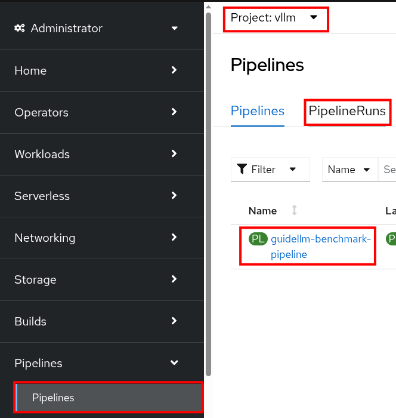
+
Click on the pipeline run that you just created and select the *Logs* tab.

. *Security Scan* - The first gate runs Garak against the model endpoint, probing for jailbreaks, toxic output, PII leaks, prompt injection, and other vulnerabilities. If any findings exceed the severity threshold, the pipeline halts with logged failure details.
+
image::../images/pipelinerun-security-scan.png["security scan task logs"]

. *GPU Advisor* - The second gate inspects cluster GPU inventory, estimates model memory requirements, and generates a ranked set of deployment options. If a single GPU is available with an existing workload, time-slicing will be proposed. The plan is written to the workspace for review — no deployment occurs automatically. Review the generated plan and approve before proceeding to benchmark.
+
image::../images/pipelinerun-gpu-advisor.png["gpu advisor task logs"]

. *Benchmark task* - This is the GuideLLM task. Note that we're using the default data because we want to get a baseline of how the model performs on our infrastructure. 
+
When the benchmark completes you'll see the list of result files that are created.
+
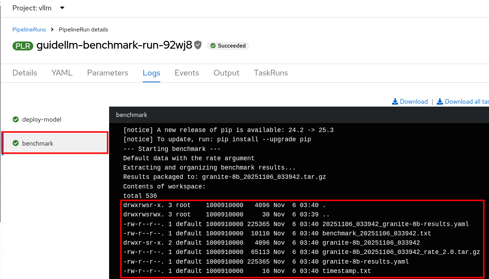

. *Upload GuideLLM task* - We upload the GuideLLM results to the *benchmark_results* bucket to S3 storage.  
+
Note the file names in the log that were successfully uploaded.
+
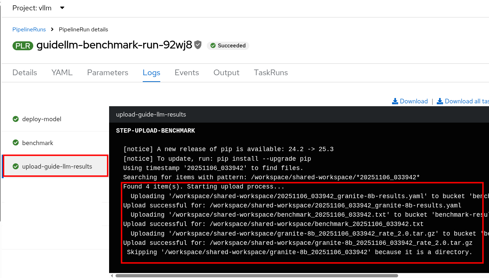
+
You can verify that the files were uploaded by viewing them in the S3 UI. Feel free to download them and look through the results. 
+
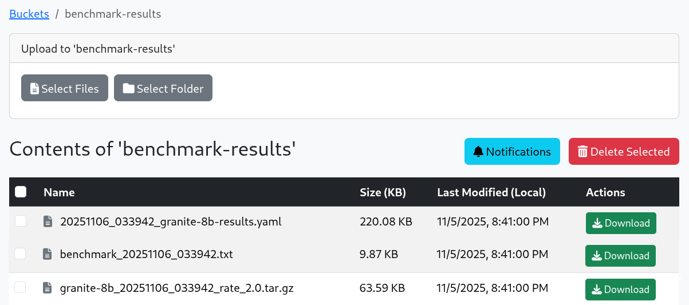
+
The *benchmark_<TIMESTAMP>.txt* contains a summary of the run. 
+
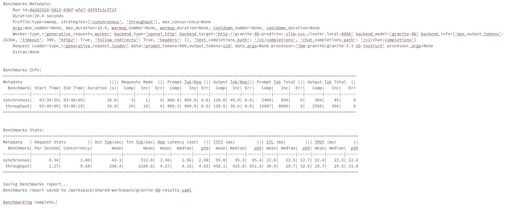
+
We'll revisit these files again when we look at the version registered in the OpenShift AI model registry.  

. *lm-eval task* - If you scroll up in the logs you should see the lm-eval results at the top. The full results are printed out to the log in JSON format.
+
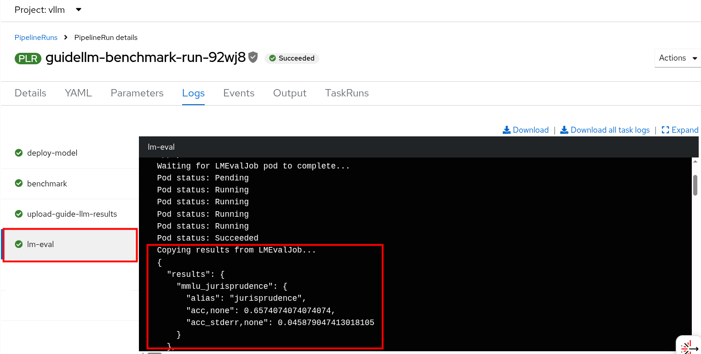

. *Upload lm-eval task* - We upload the lm-eval results to the *benchmark_results* bucket to S3 storage.  
+
Note the file names in the log that were successfully uploaded.
+
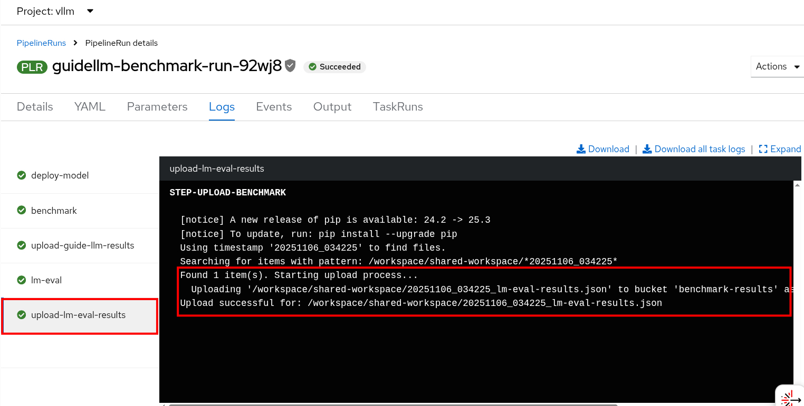
+
If you go back to the S3 UI and look at the *benchmark_results* bucket you should see the *<TIMESTAMP>_lm-eval-results.json* file now.
+
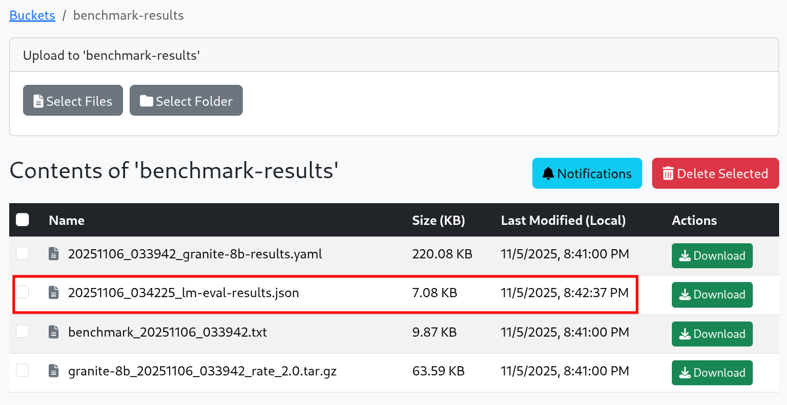

. *Register model task* - This task adds the model to the OpenShift AI model registry and adds properties that link to the GuideLLM and lm-eval results so they are easily discoverable for AI Engineers in your organization. 
+
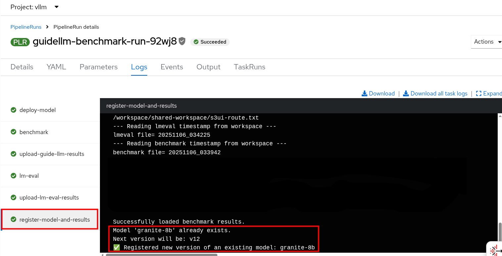
+
Go to your OpenShift AI web console. Expand *Models* and select *Model Registry*. You should see *granite-2b* in your model registry now. Click on the link and then click on the *Versions* tab.
+
Since this is the first time you've run the pipeline you'll only see one version available. Click on that version.
+
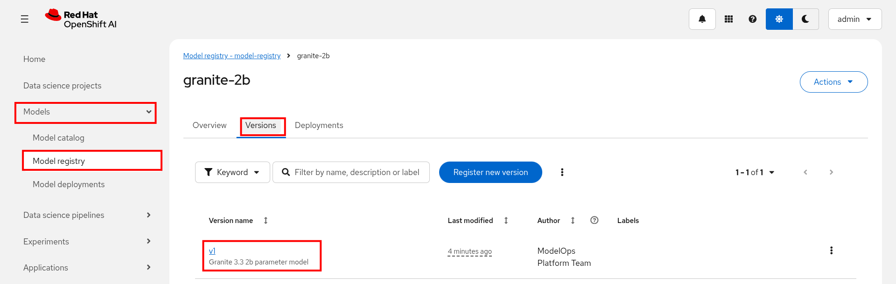
+
Scroll down on the *Details* tab of this version until you see all of the version metadata. Notice the author is the one we set in our pipeline run parameters.
+
Also, notice all of the properties that have been set from the pipeline run. All of the blue dots are benchmark results with default datasets.
+
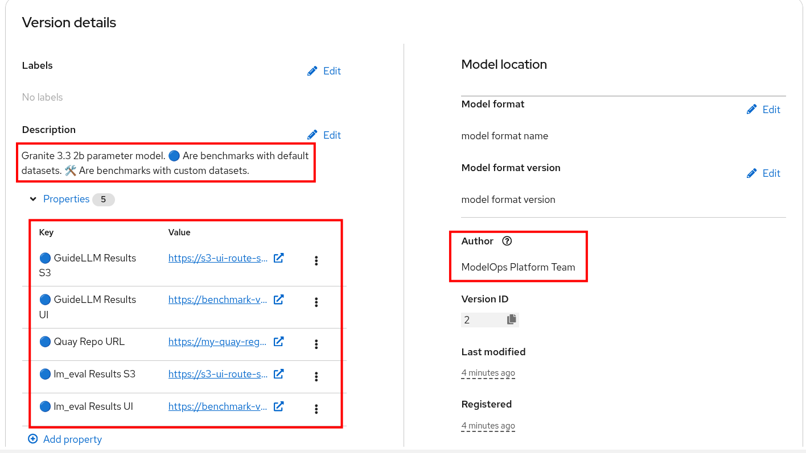
+
Click on the *GuideLLM Results UI* URL in the value column.
+
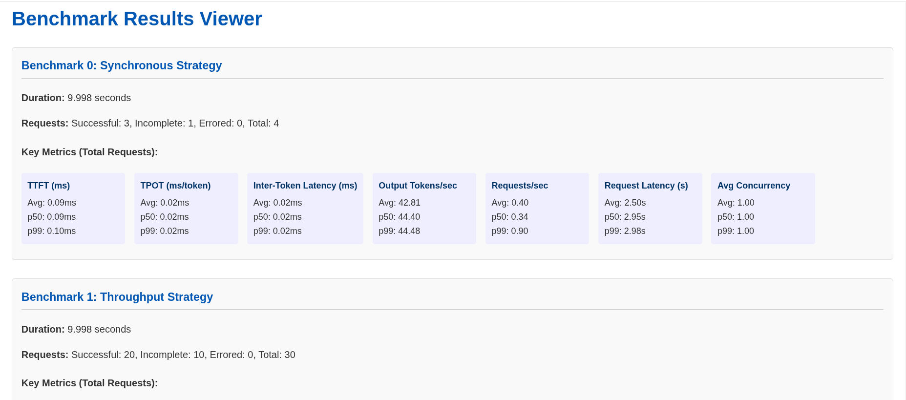
+
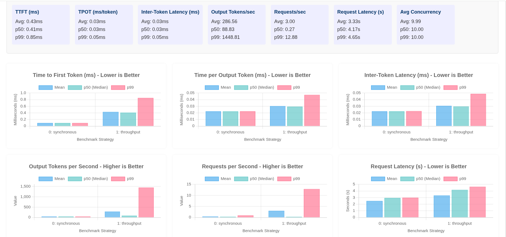
+
This UI summarizes the GuideLLM results that were generated in our GuideLLM pipeline task and uploaded to the *benchmark_results* S3 bucket.
+
Go back to the OpenShift AI model registry page and click on the *lm_eval Results UI* URL in the value column. 
+
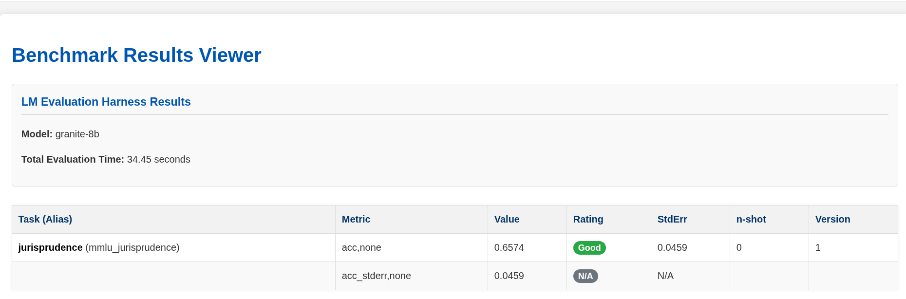
+
This UI summarizes the lm-eval results that were generated in our lm-eval pipeline task and uploaded to the *benchmark_results* S3 bucket.
+
These UI result pages for GuideLLM and lm-eval are not *supported by Red Hat* and are only used in this tutorial to give you an idea of how you can make these results easily consumable to other people in your organization, like an AI Engineer for instance. 
+
NOTE: There is a https://github.com/vllm-project/guidellm?tab=readme-ov-file#guidellm-ui[GuideLLM benchmark UI] that you should consider if you don't want to create or maintain your own solution. 

=== Recap
* Ran a Garak security scan against the model endpoint, halting deployment on any blocked findings.
* Generated a GPU capacity deployment plan with ranked options (including time-slicing when resources are constrained).
* Ran a pipeline to get performance and evaluation benchmarks on the model.
* Uploaded the results to S3 storage and registered a version of the model in the OpenShift AI model registry with associated benchmark results.

*Continue* -> <<ai_engineer_tutorial.adoc#ai-engineer, AI Engineer Tutorial>>